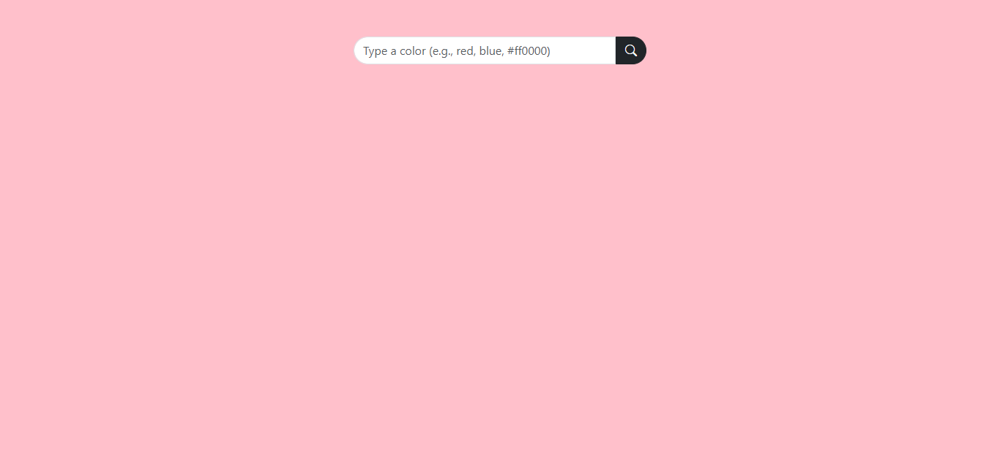

# 🎨 Color Picker

A sleek and interactive web-based tool to pick colors and retrieve their hexadecimal values. Perfect for designers and developers!

 <!-- Replace with the actual path to the screenshot -->

## 🌐 Demo

Check out the live demo: [Color Picker](https://gulzaralice1.github.io/color-picker/)

## ✨ Features

- 🎛️ **Interactive UI**: Select colors effortlessly.
- 💻 **Hexadecimal Display**: Get the exact hex code of your chosen color.
- 📱 **Responsive Design**: Works seamlessly on all devices.

## 🛠️ Installation

1. Clone the repository:

   ```bash
   git clone https://github.com/Gulzaralice1/color-picker.git
